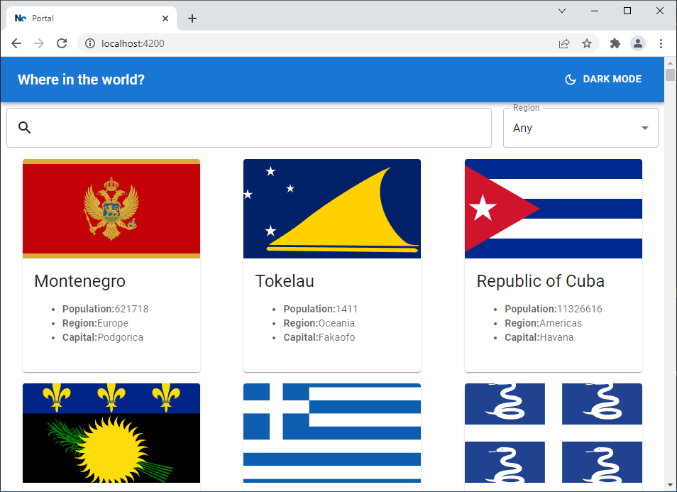

# RestCountries

This project was generated using [Nx](https://nx.dev).

🔎 **Smart, Fast and Extensible Build System**

## Rest Countries API with color theme switcher

This is sample react application generated with NX.

It uses [REST Counties V3 API](https://restcountries.com/#api-endpoints-v3https:/) to do the following:

- See all countries from the API on the homepage
- Search for a country using an `input` field
- Filter countries by region
- Toggle the color scheme between light and dark mode

## Running unit tests

Run `npx nx run-many --target=test --all` to execute the unit tests via [Jest](https://jestjs.io).

## Development server

Run `npx nx serve` for a dev server. Navigate to http://localhost:4200/. The app will automatically reload if you change any of the source files.

## Screenshot

Home Page

Activated Dark Mode Filtering (Asia and contains ja)

